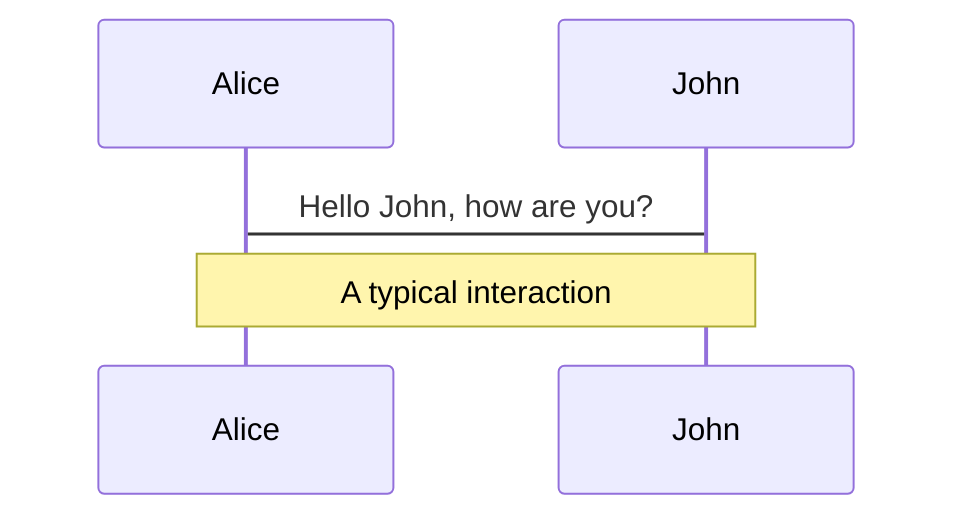
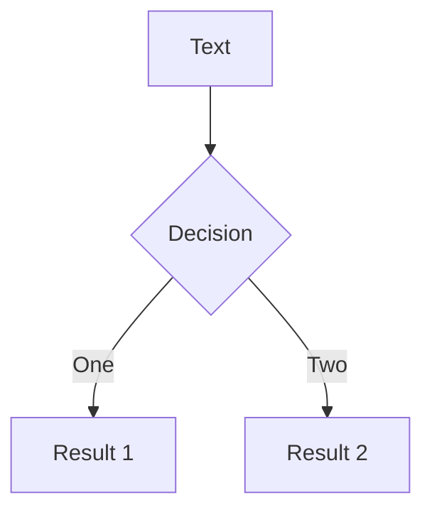
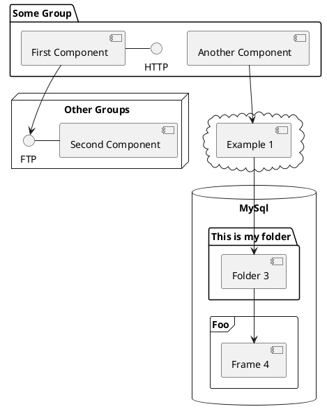

---
# try also 'default' to start simple
theme: seriph
# random image from a curated Unsplash collection by Anthony
# like them? see https://unsplash.com/collections/94734566/slidev
background: https://source.unsplash.com/collection/94734566/1920x1080
# apply any windi css classes to the current slide
class: 'text-center'
# https://sli.dev/custom/highlighters.html
highlighter: shiki
# show line numbers in code blocks
lineNumbers: false
# some information about the slides, markdown enabled
info: |
  ## Slidev Starter Template
  Presentation slides for developers.

  Learn more at [Sli.dev](https://sli.dev)
# persist drawings in exports and build
drawings:
  persist: false
---

# 欢迎来到HTTP知识大纲

这是我平时学习HTTP知识,所形成的一份大纲,将自己所学的驳杂知识,用PPT的形式做一个知识大纲,加深印象.

<div class="pt-12">
  <span @click="$slidev.nav.next" class="px-2 py-1 rounded cursor-pointer" hover="bg-white bg-opacity-10">
    按空格下一步 <carbon:arrow-right class="inline"/>
  </span>
</div>

<div class="abs-br m-6 flex gap-2">
  <a href="https://github.com/TXDE/HTTP-" target="_blank" alt="GitHub"
    class="text-xl icon-btn opacity-50 !border-none !hover:text-white">
    <carbon-logo-github />
  </a>
</div>

---

# HTTP协议

  <div style="margin-left: 10px">
    <span v-click>1.HTTP协议用于客户端和服务端之间的的通信</span>
    <ul>
      <li v-click>请求文本/图像等资源的为客户端</li>
      <li v-click>提供资源的为服务端</li>
    </ul>
  </div>
  <div style="margin-left: 10px">
    <span v-click>2.HTTP协议请求通过一系列方法告知服务器</span>
    <ul v-click>
      <li>GET:获取资源.用来请求URL中解析出来的资源地址</li>
      <li>POST:传输实体主体.将一些数据放到POST的请求体中,传输给服务器</li>
      <li>PUT:传输文件.将文件数据放到PUT请求体中,然后保存到服务器(有安全隐患)</li>
      <li>HEAD:获取报文首部.不获取报文的响应体,只是得到响应体的头部信息</li>
      <li>DELETE:删除文件.用来删除服务器上的一项文件资源(有安全隐患)</li>
      <li>OPTIONS:询问支持的方法.查询请求URL指定的资源支持的方法</li>
      <li>TRACE:追踪路径.让服务器将之前经过的服务器路径返回给客户端方法</li>
      <li>CONNECT:用隧道协议连接代码</li>
    </ul>
  </div>
  <div style="margin-left: 10px">
    <span v-click>3.HTTP协议是不保存状态的协议</span>
    <ul>
      <li v-click>协议本身不保存之前的请求以及响应报文信息(cookie解决)</li>
      <li v-click>无状态协议能够节省服务器的CPU以及内存资源的消耗,但是为了解决保存状态而引入了cookie技术,在请求和响应报文中添加set-cookie字段,服务器生成,保存在客户端,客户端下次请求携带</li>
    </ul>
  </div>
  <div style="margin-left: 10px">
    <span v-click>4.HTTP协议持久化连接</span>
    <ul>
      <li v-click> HTTP1.1用一个keep-alive的字段来控制持久化连接.减少TCP的连接所造成的开销.持久化连接的请求用管线化方式发送.管线化意味着发送请求后不必等待响应即可发送下一条请求</li>
    </ul>
  </div>

<style>
h1 {
  background-color: #2B90B6;
  background-image: linear-gradient(45deg, #4EC5D4 10%, #146b8c 20%);
  background-size: 100%;
  -webkit-background-clip: text;
  -moz-background-clip: text;
  -webkit-text-fill-color: transparent;
  -moz-text-fill-color: transparent;
  font-size: 24px!important;
  margin-bottom:10px!important;
}
.slidev-layout{
  padding: 1rem!important;
}
span{
  font-weight: 600;
}
ul{
  margin-left: 40px;
  padding: 5px 0;
}
li{
  line-height: 1.5rem!important;
  font-size: 14px!important;
}
</style>
---

## HTTP报文

<p v-click>HTTP报文都采用报文首部+空行(CRLF)+报文主体这种格式.首部字段中有通用首部,请求首部,响应首部,实体首部</p>

<div style="display: flex;">
  <div v-click>
    请求报文
    
    <div style="border: 1px solid;width: 400px;padding: 4px 10px">
      GET /form/entry HTTP/1.1 <span style="color: red">请求行</span>

      HOST:值

      Content-Type:Keep-alive

      ........... 

      报文主体数据

  </div>
  </div>
  <div style="border-left: 1px solid;padding-left: 50px" v-click>
    响应报文
    
    <div style="border: 1px solid;width: 400px;padding: 4px 10px">
      HTTP/1.1 200  OK <span style="color: red">响应行</span>

      HOST:值

      Content-Type:Keep-alive

      ...........

      报文主体数据

  </div>
  </div>
</div>

<style>
.slidev-layout{
  padding: 1rem!important;
}
</style>

---
layout: two-cols
---

# 响应状态码

状态码用来描述返回的请求结果.通过状态码,可以识别请求是被正确处理了,还是经历了什么错误. 

|                | 类别       | 原因            |  
|----------------|----------|---------------|
| <kbd>1XX</kbd> | 信息性状态码   | 接收的请求正在处理     | 
| <kbd>2XX</kbd> | 成功状态码    | 请求正常处理完毕      |
| <kbd>3XX</kbd> | 重定向状态码   | 需要进行附加操作以完成请求 |
| <kbd>4XX</kbd> | 客户端错误状态码 | 服务器无法处理请求     |
| <kbd>5XX</kbd> | 服务器错误状态码 | 服务器处理请求出错     |

::right::

<div style="margin: 25px 0 0 10px;padding-left:20px;font-size: 12px;border-left: 1px solid" v-click>
  状态码举例:
  <table>
    <tr>
      <td>200 OK</td>
      <td>表示从客户端发来的请求被服务端正确处理了,在响应报文内,随状态码一起返回的信息会因方法的不同而改变</td>
    </tr>
    <tr>
      <td>204 No content</td>
      <td>该状态码代表服务器已经成功处理,但在返回的响应报文中不含实体的主体部分.只用来客户端给服务端发消息,而服务端不需要给客户端发新消息</td>
    </tr>
    <tr>
      <td>301 Moved Permanently</td>
      <td>永久性重定向.请求的资源已经分配了新的URI</td>
    </tr>
    <tr>
      <td>302 Found</td>
      <td>临时性重定向.请求的资源已经分配了新的URI,但是只是临时的,有可能还会改变</td>
    </tr>
    <tr>
      <td>304 Not Modified</td>
      <td>服务器允许请求,但是请求附带的条件不满足</td>
    </tr>
    <tr>
      <td>400 Bad Request</td>
      <td>请求报文中存在语法错误</td>
    </tr>
    <tr>
      <td>403 Forbidden</td>
      <td>表明对请求的资源的访问被服务器拒绝了,拒绝原因服务器没有必要给出</td>
    </tr>
    <tr>
      <td>404 Not Found</td>
      <td>服务器无法找到请求资源</td>
    </tr>
    <tr>
      <td>500 Internal Server Error</td>
      <td>服务端在执行请求时候发生了错误,也有可能是web页面存在bug</td>
    </tr>
    <tr>
      <td>503 Service Unavailable</td>
      <td>服务器暂时处于超负载或正在进行停机维护,现在无法处理请求</td>
    </tr>
  </table>
</div>

<style>
.slidev-layout{
  padding: 1rem!important;
}
</style>
---

# 首部字段

首部字段是为了给浏览器和服务器提供报文大小,使用语言,认证信息等内容

类型

1.通用首部字段

2.请求首部字段

3.响应首部字段

4.实体首部字段

<style>
h1{
  font-size: 12px;
}
.slidev-layout{
  padding: 1rem!important;
}
</style>

---

# Animations

```html
<div
  v-motion
  :initial="{ x: -80 }"
  :enter="{ x: 0 }">
  Slidev
</div>
```

<div class="w-60 relative mt-6">
  <div class="relative w-40 h-40">
    
    
    
  </div>

  <div
    class="text-5xl absolute top-14 left-40 text-[#2B90B6] -z-1"
    v-motion
    :initial="{ x: -80, opacity: 0}"
    :enter="{ x: 0, opacity: 1, transition: { delay: 2000, duration: 1000 } }">
    Slidev
  </div>
</div>

<script setup lang="ts">
const final = {
  x: 0,
  y: 0,
  rotate: 0,
  scale: 1,
  transition: {
    type: 'spring',
    damping: 10,
    stiffness: 20,
    mass: 2
  }
}
</script>

<div
  v-motion
  :initial="{ x:35, y: 40, opacity: 0}"
  :enter="{ y: 0, opacity: 1, transition: { delay: 3500 } }">


</div>

---

# LaTeX

---

# Diagrams


<div class="grid grid-cols-3 gap-10 pt-4 -mb-6">







</div>


---
layout: center
class: text-center
---

# Learn More

